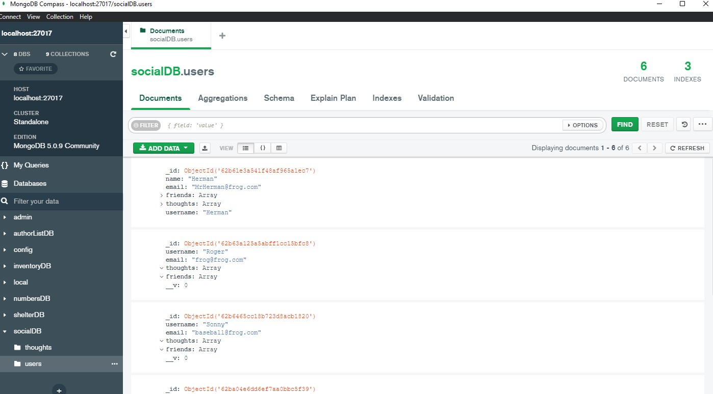

# The Social Network API

## Description

---

A backend social network development tool. Used to add users, messages, and reactions using the Mongdb technology.

## <ins>Table of Contents</ins>

- [Installation](#installation)
- [Usage](#usage)
- [License](#license)
- [Contributing](#contributing)
- [Tests](#tests)
- [Contact](#questions)

---

## Installation

mongoose, express libraries

## Usage

exchange messages between users

## License

This project is licensed under

## Contributing

Kmac5000

## Tests

none

---

## Questions:

Riverbatrock@gmail.com

https://github.com/Kmac5000
